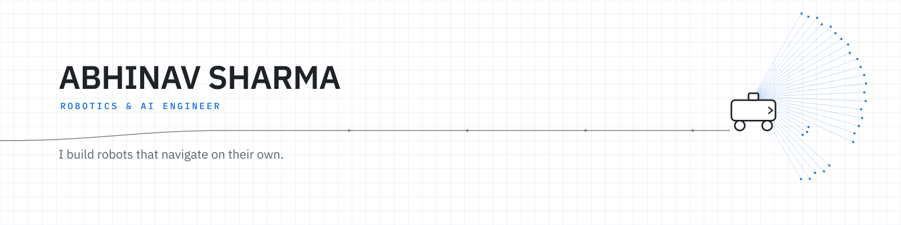
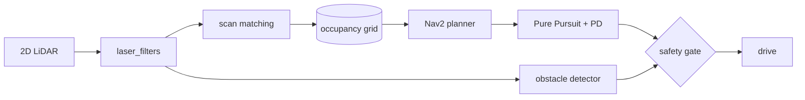

<picture>
  <source media="(prefers-color-scheme: dark)" srcset="header-dark.png">
  <source media="(prefers-color-scheme: light)" srcset="header-light.png">
  
</picture>

**Robotics & AI Engineer.** I work on autonomous mobile robots — LiDAR-based systems that map a space, plan a path, and hold it without hitting anything that moves.

Most of my work lives in the gap between a model that runs in a notebook and one that runs on hardware with a battery and no patience for a dropped frame. ROS 2 for the stack, C++ where latency matters, Python where the logic changes daily.

---

## Selected work

### KisanAI — plant disease detection at the edge

A multimodal plant disease assistant built for the field, not the lab. MobileNet CNN at **88% accuracy**, converted to TensorFlow Lite so it runs on a phone offline — out where the disease actually is, without a network connection.

`Python` `TensorFlow` `TensorFlow Lite` `MobileNet` `CNN`
→ [repository](https://github.com/USERNAME/REPO)

### Autonomous mobile robot — 2D LiDAR navigation

A ROS 2 teach-and-repeat navigation stack. Scan matching to build occupancy grids from raw laser data, path tracking with a Pure Pursuit controller running PD and curvature feed-forward, and a safety gate that brakes rather than coasts when something enters the corridor.

`ROS 2 Jazzy` `C++` `Nav2` `laser_filters` `2D LiDAR`
→ [repository](https://github.com/USERNAME/REPO)

### Karma Blazer — tracking and obstacle avoidance

Object detection and behavioural following on a mobile platform. Detection in C++ because the loop had a deadline; the following behaviour in Python because it changed every other day.

`C++` `Python` `ROS 2`
→ [repository](https://github.com/USERNAME/REPO)

---

## How the pieces fit

Perception is cheap. Deciding what to do about it on time is the job.

---

## Tools

|  |  |
|:--|:--|
| **Languages** | C++ · Python |
| **Robotics** | ROS 2 Jazzy · Nav2 · laser_filters · obstacle detection · 2D LiDAR · sensor fusion |
| **Machine learning** | TensorFlow · TensorFlow Lite · CNNs · MobileNet |
| **Environment** | Ubuntu 24.04 · Linux · Git |

---

## Reach me

Working on autonomous navigation or edge AI? Tell me what you're building.

[sharmaabhinav1907@gmail.com](mailto:sharmaabhinav1907@gmail.com) · [LinkedIn](https://www.linkedin.com/in/abhii1907)
